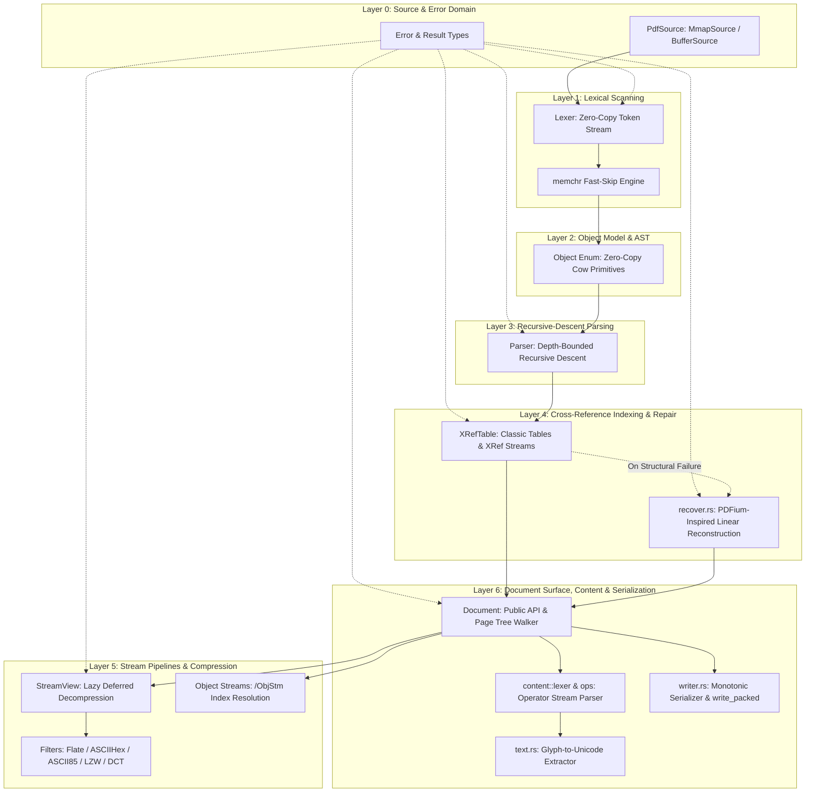
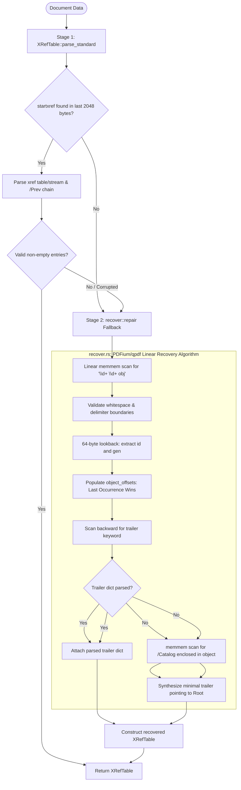

# oxpdf System Architecture & Design Specification (v1.0)

This document defines the formal architecture, memory execution model, fault-tolerant reconstruction engine, and engineering constraints for **`oxpdf`**, the high-performance, memory-bounded, pure-Rust streaming PDF engine by `@isaim0011`.

---

## 1. Architecture Overview: The L0–L6 Pipeline

`oxpdf` is structured as a strictly stratified, feed-forward processing pipeline composed of seven architectural layers ($L_0$ through $L_6$). Each layer possesses explicit data ownership boundaries, strictly typed error domain mappings, and invariant guarantees designed to eliminate undefined behavior, heap exhaustion, and recursion stack overflow.



### Layer Breakdown & Module Responsibilities

| Layer | Primary Modules | Key Types & Traits | Architectural Responsibility |
|---|---|---|---|
| **$L_0$** | `source.rs`, `error.rs` | `PdfSource`, `MmapSource`, `BufferSource`, `Error`, `Result<T>` | Abstracts backing storage (OS memory-mapped files vs. borrowed byte slices); encapsulates granular, non-stringly typed error variants with exact byte offsets. |
| **$L_1$** | `lexer.rs` | `Lexer<'a>`, `Token<'a>` | Zero-copy byte-level lexical scanner; tokenizes numbers, names, strings, delimiters, and comments conforming to ISO 32000-1 §7.2; accelerated via `memchr`. |
| **$L_2$** | `types.rs` (`object.rs`) | `Object<'a>`, `ObjectId` | Lightweight AST primitives leveraging `Cow<'a, ...>` and `SmallVec<[u8; 32]>`; represents Booleans, Integers, Reals, Names, Strings, Arrays, Dictionaries, Streams, and Indirect References (`R`). |
| **$L_3$** | `parser.rs` | `Parser<'a>` | Depth-bounded recursive-descent parser; enforces static limits on nesting depth (default 256) and collection capacity (2M keys/elements) to eliminate stack-overflow DoS attacks. |
| **$L_4$** | `xref.rs`, `recover.rs` | `XRefTable`, `XRefEntry`, `repair()` | Dual-mode cross-reference indexing; backward resolution from `startxref` supporting classic subsections and PDF 1.5+ binary XRef streams (`/Type /XRef`); seamless fallback to linear reconstruction scanner. |
| **$L_5$** | `stream.rs`, `filter/` | `StreamView<'a>`, `FilterKind` | Lazy, un-evaluated stream views; deferred on-demand decompression; hard 256MB decompression ceiling protecting against zip-bomb OOM; `/ObjStm` index resolution with internal caching. |
| **$L_6$** | `document.rs`, `content/`, `text.rs`, `writer.rs` | `Document<'a>`, `Serializer<W>` | High-level facade: loop-guarded worklist page tree walker (`/Root -> /Pages -> /Kids`); dedicated content stream operator lexer; Unicode glyph extraction; monotonic zero-allocation serializer and `/ObjStm` compactor (`write_packed`). |

---

## 2. Memory Model & Streaming Architecture

### Why Non-Linear PDF Requires Random Access

A pervasive misconception in document engineering is that arbitrary PDF documents can be ingested via a pure, forward-only streaming reader (such as an unbuffered `std::io::Read` stream). The physical architecture mandated by ISO 32000-1 renders seek-free streaming mathematically impossible:

1. **Trailer-First Bootstrap**: A compliant PDF reader begins execution at the *end* of the file. It must inspect the terminal 1024–2048 bytes to locate the `startxref` keyword and EOF marker (`%%EOF`), extract the byte offset of the cross-reference index, and jump backwards to that offset.
2. **Arbitrary Object Layout**: Indirect objects (`N G obj ... endobj`) are not serialized in presentation, logical, or reading order. A document catalog (`/Root`) might reside at byte offset 48,000, while Page 1's dictionary is at offset 12,000, its content stream is at offset 3,500,000, and its font descriptors are at offset 420.
3. **Indirect Reference Dereferencing**: Resolving a single visual page requires traversing an object reference graph:
   $$\text{Trailer} \longrightarrow \text{Catalog} \longrightarrow \text{Pages Tree} \longrightarrow \text{Page} \longrightarrow \text{Resources} \longrightarrow \text{Font} \longrightarrow \text{Encoding / ToUnicode}$$
   Each link in this chain represents an arbitrary jump across the physical byte address space.
4. **Incremental Updates**: Incremental modifications append updated objects and new `xref` tables to the end of the file, linked by a `/Prev` offset pointer chain. Modern state resolution requires following the `/Prev` chain backwards from EOF to origin.

Consequently, `oxpdf` explicitly rejects the premise of non-seekable streaming parsers. Any application demanding ingestion from unseekable network sockets or pipes must buffer incoming bytes to disk or temporary storage before initializing the engine.

### The `PdfSource` Abstraction: OS Page Cache Offloading

`oxpdf` abstracts physical byte access behind the object-safe, zero-copy `PdfSource` trait defined in `src/source.rs`:

```rust
pub trait PdfSource {
    fn read_at(&self, offset: usize, len: usize) -> Result<&[u8]>;
    fn len(&self) -> usize;
    fn is_empty(&self) -> bool { self.len() == 0 }
    fn as_slice(&self) -> Result<&[u8]>;
}
```

The engine provides exactly two production implementations:

```rust
// Native targets (Linux, macOS, Windows) backed by memmap2
pub struct MmapSource {
    mmap: memmap2::Mmap,
}

// In-memory slice backed source for WASM32, testing, and pre-buffered payloads
pub struct BufferSource<'a> {
    data: &'a [u8],
}
```

#### The Kernel-Level Memory Offload (`MmapSource`)

When operating on native targets, `MmapSource` leverages `memmap2::Mmap::map(file)`. Virtual memory mapping shifts the entire burden of file caching, read-ahead windowing, and page eviction onto the host Operating System kernel:

* **Zero Process Allocation**: Mapping a 10GB PDF does not allocate 10GB of virtual heap inside the `oxpdf` process space. Instead, the kernel allocates page table entries pointing directly to physical storage.
* **Demand Paging**: When `oxpdf` inspects an object at offset `0x4F2A00`, the MMU triggers a minor page fault. The OS kernel reads only the corresponding 4KB memory page into physical RAM.
* **Automatic Page Eviction**: Under system memory pressure, the OS kernel's Virtual Memory Manager automatically discards unmodified, clean read-only pages from RAM without requiring swap space.
* **Multi-Process Sharing**: If multiple processes or threads inspect the same PDF file via `MmapSource`, physical memory pages are deduplicated and shared across all address spaces by the kernel page cache.

For `wasm32-unknown-unknown` where memory-mapping APIs do not exist in the browser runtime sandbox, `BufferSource` wraps a pre-allocated borrowed slice (`&'a [u8]`), preserving identical zero-copy borrow lifetimes across compilation targets.

### Enforcing Bounded Memory (<32MB RSS) on Multi-Gigabyte Files

`oxpdf` delivers deterministic, bounded resident set size (RSS < 32MB) even when parsing 10GB+ PDF files by strictly enforcing five invariant architectural rules:

1. **Zero-Copy Borrowed Slices**: AST tokens and object names borrow directly from the underlying source lifetime (`Cow<'a, str>`, `&'a [u8]`). Small strings and hexadecimal buffers avoid heap allocations entirely by utilizing inline stack storage up to 32 bytes via `SmallVec<[u8; 32]>`.
2. **Demand-Driven Lazy Loading**: `Document::load` parses exclusively the cross-reference index (`XRefTable`) and trailer dictionary. No page dictionaries, content streams, or metadata objects are parsed during initialization. Objects are materialized only when explicitly requested via `Document::get_object(id)`.
3. **Deferred Stream Decompression (`StreamView`)**: Compressed streams (FlateDecode, ASCIIHexDecode, ASCII85Decode) remain untouched in their raw compressed byte representation. Decompression occurs strictly on demand via `StreamView::decode()` and can be discarded immediately after consuming.
4. **Hard Defense-in-Depth OOM Bounds**: To prevent algorithmic complexity attacks, memory bombs, and malformed payload overflows, `oxpdf` enforces un-bypassable structural caps throughout the pipeline:

| Subsystem | File | Invariant Safety Cap | Defense Rationale |
|---|---|---|---|
| **Array Parser** | `parser.rs` | `MAX_ARRAY_ELEMENTS = 2_000_000` | Prevents `/Kids` or coordinate array memory-exhaustion bombs. |
| **Dictionary Parser** | `parser.rs` | `MAX_DICT_KEYS = 2_000_000` | Guards against exponential map growth from malicious dictionaries. |
| **Stream Decompressor** | `stream.rs` | `MAX_DECOMPRESS_BYTES = 256 MB` | Strictly prevents Deflate/zlib zip-bomb payload expansion. |
| **XRef Subsection** | `xref.rs` | $\text{Count} \le \max(1, \text{file\_len} / 20)$ | Each standard xref entry is physically 20 bytes; prevents OOM from bogus 3-billion entry counts. |
| **Page Tree Walker** | `document.rs` | `MAX_PAGES = 10_000_000` | Protects worklist memory from infinite cyclic or explosive page node graphs. |
| **Call Stack Depth** | `parser.rs` | `max_depth = 256` | Replaces unchecked stack recursion with bounded descent; immunity to stack overflows. |

5. **Loop-Guarded Worklist Traversal**: Traversal of nested page tree nodes (`/Pages -> /Kids`) uses an iterative, heap-allocated worklist combined with an explicit `HashSet<u32>` of visited object IDs. Circular node references (Pillar 4) are detected and skipped without runaway recursion or allocation loops.

---

## 3. Fault-Tolerant Reconstruction Engine

The PDF format in the wild is notoriously malformed. Web servers sever file downloads mid-transmission, third-party generators emit miscalculated byte offsets, and manual edits strip cross-reference trailers. `oxpdf` provides an industry-grade, two-stage recovery engine designed to recover documents that fail in other pure-Rust parsers.

### The Two-Stage Cross-Reference Architecture



### The PDFium / QPDF Linear Recovery Algorithm (`recover.rs`)

When standard backward parsing fails, `XRefTable::parse_or_reconstruct` delegates directly to `crate::recover::repair(data)`, which implements the Chromium PDFium and QPDF standard reconstruction algorithm with zero external parser combinator dependencies:

1. **Linear Keyword Discovery**: The entire byte buffer is scanned using `memchr::memmem::Finder::new(b"obj")`.
2. **Boundary Validation**: For each match of `b"obj"`, boundary checks ensure the token is not an embedded substring of another identifier:
   * Offset $idx - 1$ must be an ASCII whitespace or delimiter.
   * Offset $idx + 3$ must be whitespace or a standard PDF delimiter character (`<`, `[`, `/`, `%`).
3. **Bounded Lookback Lexing**: The scanner inspects a window of up to 64 bytes immediately preceding the `obj` match (`lookback_start = match_idx.saturating_sub(64)`). A bounded instance of `Lexer` extracts up to 128 tokens within this window.
4. **Object Identification**: The final two tokens preceding `obj` must parse as `Token::Integer(id)` and `Token::Integer(gen)`, where $id > 0$ and $0 \le gen \le 65535$. The exact start offset of the object definition is resolved within the lookback window.
5. **Incremental Update Resolution (Last-Occurrence-Wins)**: Entries are recorded into a map of `u32 -> (u16, u64)`. Because PDF incremental updates append revisions to the end of the file, later occurrences of a given `(id, gen)` overwrite earlier ones. This guarantees that modified and undeleted objects take precedence over obsolete definitions.
6. **Trailer Reconstruction & Catalog Synthesis**:
   * The scanner executes a backward scan for the `trailer` keyword and attempts to parse the succeeding dictionary.
   * If no valid trailer dictionary exists (e.g. the file was truncated before the trailer was written), the scanner initiates a fallback scan for `/Catalog`.
   * Upon matching `/Catalog`, the algorithm locates the enclosing object ID whose byte range contains the match and synthesizes a minimal trailer dictionary:
     $$\{\text{"Root"}: \text{cat\_id}, \text{"Size"}: \text{entry\_count} + 1\}$$
7. **Exhaustion Guard**: If no valid `obj` headers can be parsed from the byte buffer, the engine terminates with `Err(Error::RecoveryFailed { attempts: 1 })`.

### Strict vs. Resilient Modes

`oxpdf` exposes two document loading entrypoints conforming to §3.1:

* **`Document::load(source)`**: The default, production-grade entrypoint. Automatically engages `recover::repair` upon encountering corrupted cross-reference structures, broken `/Prev` links, or truncated trailers.
* **`Document::load_strict(source)`**: High-assurance validation mode. Fails immediately with a typed error on any structural flaw, bypassing recovery entirely. Designed for archival compliance verification and PDF validation test suites.

---

## 4. Staged Lexer Performance Path

The lexical scanning pipeline in `src/lexer.rs` tokenizes the input byte stream into zero-allocation tokens conforming to ISO 32000-1 §7.2. Performance engineering follows a disciplined, staged progression.

### Stage A: Current `memchr`-Accelerated Scalar Lexer

The baseline lexer operates directly over borrowed byte slices (`&'a [u8]`):

* **Accelerated Boundary Scanning**: Uses `memchr::memmem::Finder` for locating stream terminators (`endstream`) and `startxref` tokens, replacing manual byte-by-byte loops with AVX2/SSE2/NEON vector-accelerated single-byte and substring searches.
* **ISO 32000-1 Whitespace Skipping**: Fast-skips whitespace bytes (`0x00`, `0x09`, `0x0A`, `0x0C`, `0x0D`, `0x20`) using branch-optimized jump tables.
* **Literal & Hexadecimal String Parsing**: Decodes literal escape sequences (`\n`, `\r`, `\t`, octal escapes `\ddd`, balanced nested parentheses `(...)`) into inline `SmallVec<[u8; 32]>` buffers.
* **Infinite-Loop Immunity**: Guarded against unhandled delimiter combinations (e.g. lone `>` characters without a matching pair) by explicitly advancing the cursor and surfacing typed syntax errors rather than spinning indefinitely.

#### Profiling Gate to Progress Beyond Stage A
Per §4.1 of the specification, Stage A remains the primary scalar implementation until corpus profiling proves that the lexer represents a demonstrable bottleneck. The trigger condition to move to Stage B is:
$$\text{Lexer Wall-Clock Time} > 30\% \quad \text{on representative large PDFs (measured via } \texttt{cargo flamegraph}\text{)}.$$
Optimization without prior profiling verification is explicitly prohibited.

### Stage B: Chunked SIMD Structural Classification

Stage B represents the portable SIMD evolution path, drawing architectural principles from `simdjson`:

* **Portable Vector Primitives**: Implemented strictly via standard library portable SIMD (`core::simd` / `std::simd`). Platform-specific raw intrinsics (`_mm256_cmpeq_epi8`, inline assembly) and unmaintained third-party abstraction crates (`packed_simd`, `wide`) are permanently rejected to guarantee maintainability across x86_64, AArch64, and wasm32 from a single source tree.
* **32-Byte Vector Classification**: Processes 32-byte chunks simultaneously using `Simd<u8, 32>` vectors:
  ```rust
  // Structural classification bitmasks generated in a single instruction sequence
  let chunk: Simd<u8, 32> = Simd::from_slice(&data[pos..pos + 32]);
  let ws_mask = chunk.simd_eq(Simd::splat(b' '))
              | chunk.simd_eq(Simd::splat(b'\n'))
              | chunk.simd_eq(Simd::splat(b'\r'))
              | chunk.simd_eq(Simd::splat(b'\t'));
  let delim_mask = chunk.simd_eq(Simd::splat(b'/'))
                 | chunk.simd_eq(Simd::splat(b'('))
                 | chunk.simd_eq(Simd::splat(b')'))
                 | chunk.simd_eq(Simd::splat(b'<'))
                 | chunk.simd_eq(Simd::splat(b'>'))
                 | chunk.simd_eq(Simd::splat(b'['))
                 | chunk.simd_eq(Simd::splat(b']'));
  ```
* **Bitmask Bit-Twiddling**: Classification produces integer bitmasks. Trailing zero counts (`trailing_zeros()`) allow the lexer cursor to skip over large runs of whitespace or scan name boundaries without per-byte branch evaluation.
* **Mandatory Scalar Fallback**: The tail buffer remaining after processing whole 32-byte blocks ($len < 32$) is always evaluated by the Stage A scalar fallback path.
* **Feature Gating**: Gated behind `#[cfg(feature = "simd")]`, enabled by default, with `--no-default-features` compiling pure scalar code for constrained or non-SIMD embedded and WASM environments.

### Content-Stream Lexer Specialization (`content::lexer`)

Content streams (`/Contents`) possess a fundamentally different statistical profile than dictionary/structural PDF streams:
* Structural streams are dominated by hierarchical keys, names, indirect references, and nested dictionaries.
* Content streams consist almost exclusively of high-density numeric coordinate matrices and single- or double-character operators (`cm`, `re`, `m`, `l`, `c`, `BT`, `ET`, `Tj`, `TJ`, `Do`).

To prevent performance compromises, `oxpdf` isolates content stream evaluation into a dedicated `content::lexer` module. This instance shares primitive token representations with `Token` but dispatches over an operator-optimized state machine tuned specifically for rapid coordinate stream ingestion.

---

## 5. What oxpdf will never do

These are not roadmap items deferred to later tiers. They are **permanently out of scope** for the `oxpdf` core crate, by design, the same way MuPDF permanently excludes JS/forms:

- **Rendering to pixels.** oxpdf parses and extracts structure/text. It does not rasterize. Anyone wanting rendering should pair oxpdf's parse output with a separate rasterizer, or use PDFium/MuPDF directly for that job.
- **JavaScript execution / interactive forms.** Same reasoning as MuPDF's exclusion — this is a huge, security-sensitive surface unrelated to "parse PDFs correctly and fast."
- **PDF creation from scratch** (writing a brand-new PDF with no source document) — the Tier 6 writer exists to **round-trip and transform existing documents** (qpdf's model), not to be a page-layout/PDF-generation library. If document generation is wanted, that's a different crate (`oxpdf-gen`, unscheduled, not part of this plan).
- **JBIG2 and CCITTFax Group 4 are explicitly deferred, not rejected** — they're rare outside scanned-fax-style documents; `UnsupportedFilter` is the correct, honest return value until real demand appears, not silent mishandling.

---

## 6. v1.0 Production Criteria: The 5 Hard Gates

Versioning follows strict engineering discipline. Until all five conditions below are definitively met, `oxpdf` remains strictly in `0.x`. No release will be designated `1.0` on vibes, assumptions, or partial credit:

```markdown
1. Tier 1 + Tier 2 complete (object model, xref, recovery, corpus pass rate published)
2. Zero panics on the full corpus (§6 gate)
3. BENCHMARKS.md published with real numbers for throughput and peak RSS
4. Text extraction (Tier 5) working for at least Latin-script, non-CID fonts
5. WASM build green in CI with a real (not just compiling) bounded-memory path
```

### Detailed Evaluation Rules for the Gates

1. **Tier 1 & Tier 2 Completion**: The core object model, cross-reference indexer (supporting both traditional tables and `/Type /XRef` streams), `/ObjStm` decompressor, and `recover.rs` linear reconstruction pass must be fully integrated. Automated test pass rates over the public corpus (`pdf.js` test suite, veraPDF, and the 1,000-mutant synthetic corpus) must be published.
2. **The Zero-Panic Invariant (`Panics: 0`)**: The corpus harness (`tests/corpus.rs`) must process all test files and adversarial mutants without triggering a single Rust panic or unhandled abort. Any panic in any module immediately blocks release tagging. Errors must map cleanly to explicit `Error` enum variants.
3. **Empirical Benchmarks (`BENCHMARKS.md`)**: Throughput (MB/s) and peak RSS memory consumption must be measured using `/usr/bin/time -v` on 2GB and 10GB synthetic PDF documents. Theoretical claims of "<32MB" must be replaced with the exact measured resident memory numbers.
4. **Latin-Script Text Extraction**: The `Document::extract_text` and `Document::extract_text_all` API surface must correctly resolve content stream text operators (`Tj`, `TJ`), font resource dictionaries, standard encoding vectors (WinAnsiEncoding, StandardEncoding, MacRomanEncoding), and `ToUnicode` CMaps for Latin-script typefaces.
5. **Verified WASM Execution**: The `wasm32-unknown-unknown` compilation target must pass CI checks without default native features. Memory consumption under `BufferSource` must demonstrate true bounded execution inside WebAssembly runtimes rather than simply compiling without syntax errors.

---

## 7. Summary & Invariant Verification Matrix

| Architectural Principle | Implementation Mechanism | Enforcement Point |
|---|---|---|
| **Zero Undefined Behavior** | Pure Rust (`#![forbid(unsafe_code)]` except OS `mmap`) | CI clippy / build passes |
| **Bounded Memory (<32MB)** | `MmapSource` OS page cache + lazy loading + safety caps | Nightly `/usr/bin/time -v` CI job |
| **Recursion Stack Safety** | `Parser::with_max_depth(256)` + iterative worklist | Recursive bomb unit tests |
| **Zip-Bomb Immunity** | `StreamView::MAX_DECOMPRESS_BYTES = 256MB` | `stream.rs` decode unit tests |
| **Infinite Loop Immunity** | Lexer delimiter error dispatch + visited HashSet | `lexer.rs` lone delimiter tests |
| **Resilient Fault Tolerance** | `recover::repair` last-occurrence-wins scan | `tests/corpus.rs` mutant suite |
